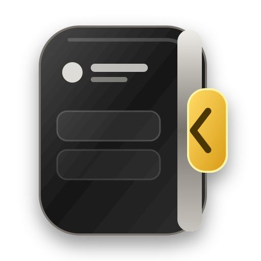
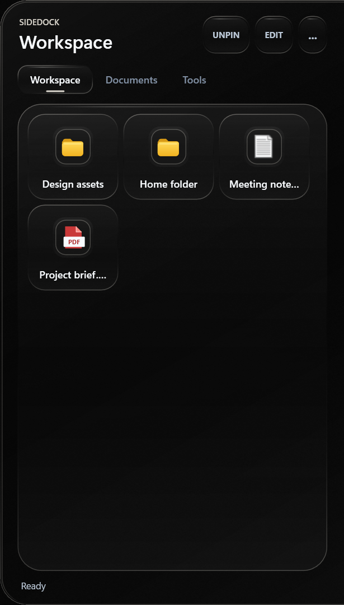

<p align="center">
  
</p>

<h1 align="center">SideDock</h1>

<p align="center">
  A fast, translucent Windows edge drawer for the files and folders you reach for every day.
</p>

<p align="center">
  <a href="https://github.com/AidedPolecat6/SideDock/actions/workflows/build.yml"></a>
  <a href="https://github.com/AidedPolecat6/SideDock/releases/latest"></a>
  
  
  <a href="LICENSE"></a>
</p>

<p align="center">
  
</p>

## Why SideDock?

SideDock stays hidden on the right edge of your screen until you need it. Hover over the handle or press `Ctrl+Alt+Space`, launch what you need, and let the drawer disappear again.

| | |
|---|---|
| **Folder-native tabs** | Add a folder shortcut and SideDock mirrors its direct contents without changing the target folder. |
| **Two layouts** | Use compact tiles or full-width rows with wrapped names, saved independently for each tab. |
| **Fast navigation** | Browse folders through lazy cascading menus without opening a new Explorer window. |
| **Windows integration** | Native shell icons, global hotkey, monitor-aware positioning, startup support, and outside-click closing. |
| **Built for focus** | Pin when needed, edit only when unlocked, and keep the desktop clear the rest of the time. |

## Download

1. Download `SideDock.exe` from the [latest release](https://github.com/AidedPolecat6/SideDock/releases/latest).
2. Install the [.NET 8 Desktop Runtime](https://dotnet.microsoft.com/download/dotnet/8.0) if Windows does not already have it.
3. Put the executable in a permanent folder and run it.

SideDock currently targets Windows x64. It runs without administrator privileges.

## Quick Start

1. Hover over or click the handle at the middle of the right screen edge.
2. Create a Windows shortcut to a folder you want as a tab.
3. Move the `.lnk` into `C:\tools\SideDock shortcuts`.
4. SideDock detects the shortcut and creates a read-only linked tab automatically.

Linked tabs never modify the target folder. Removing one deletes only its descriptor shortcut after confirmation.

## Controls

| Action | Control |
|---|---|
| Open or close | Hover the edge handle, click it, or press `Ctrl+Alt+Space` |
| Keep open | Select **PIN** |
| Rename or rearrange | Select **EDIT** |
| Show long filenames | Enable **Full-width rows for this tab** in the `...` menu |
| Refresh a tab | Select **Refresh current tab folder** in the `...` menu |
| Learn the workflows | Select **How to use** in the `...` menu |

Configuration is stored in `%LOCALAPPDATA%\SideDock\config.json` with an automatic backup at `config.backup.json`.

## Development

Requirements: Windows 10/11 and the .NET 8 SDK.

```powershell
dotnet test .\SideDock.sln --configuration Release
dotnet publish .\src\SideDock\SideDock.csproj --configuration Release --runtime win-x64 --self-contained false --output .\publish\win-x64 -p:PublishSingleFile=true
```

SideDock uses C#/.NET 8, WPF, and native Windows APIs. Generated output under `bin`, `obj`, and `publish` is intentionally excluded from version control.

## Roadmap

- First-run folder selection wizard.
- Fully portable, self-contained release.
- Configurable shortcuts location.

## License

SideDock is licensed under the [GNU General Public License v3.0](LICENSE).
